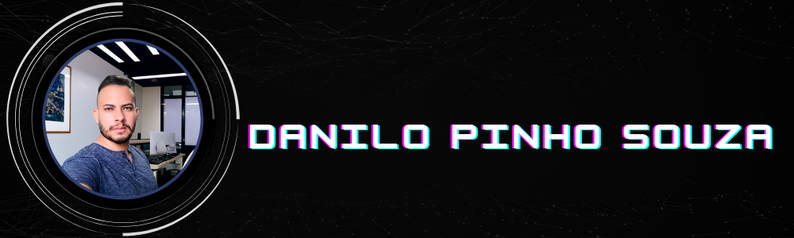
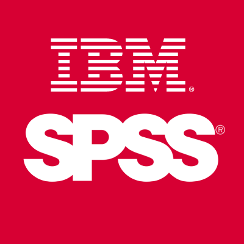

<h1 align="left">Hello  World!</h1>

###

Meu nome é Danilo, sou do litoral do PI (Parnaíba) e atualmente resido em Brasília.

Estou cursando o último período de Análise e Desenvolvimento de Sistemas na Faculdade de Tecnologia e Inovação Senac-DF. Sou apaixonado por análises de dados,  machine learning e deep learning.

<h2 align="left">Sobre mim</h2>

✨ Sou graduado em Educação Física e Pedagogia, com pós em Docência no ensino superior. 📚 Atualmente estou em transição de carreira para área de TI. 🎯 Tenho como metas MBA em análize de dados, especializações em nuvem e machine learning. 🎲 Gosto de arranhar um pouco no violão, ler contos de suspense e filme cult com pipoca.

###

<h2 align="left">Minhas Skills e Techs</h2>

###
 

    
    
    
    

###

    
    
    
    
    

###

    
    
    
    
    

###

    
    
    

###

<h2 align="left">Contatos</h2>

<a href="//www.linkedin.com/in/danpsouza"/>
    

###
___

## Sprints 

- [Sprint 1](Sprint1/README.md)
- [Sprint 2](Sprint2/README.md)
- [Sprint 3](Sprint3/README.md)
- [Sprint 4](Sprint4/README.md)
- [Sprint 5](Sprint5/README.md)
- [Sprint 6](Sprint6/README.md)
- [Sprint 7](Sprint7/README.md)
- [Sprint 8](Sprint8/README.md)
- [Sprint 9](Sprint9/README.md)
- [Sprint 10](Sprint10/README.md)

# Desafio

[Desafio Final](Desafio/README.md)

___

___

 

