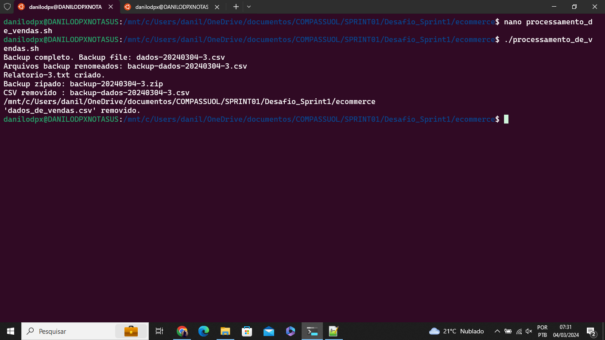
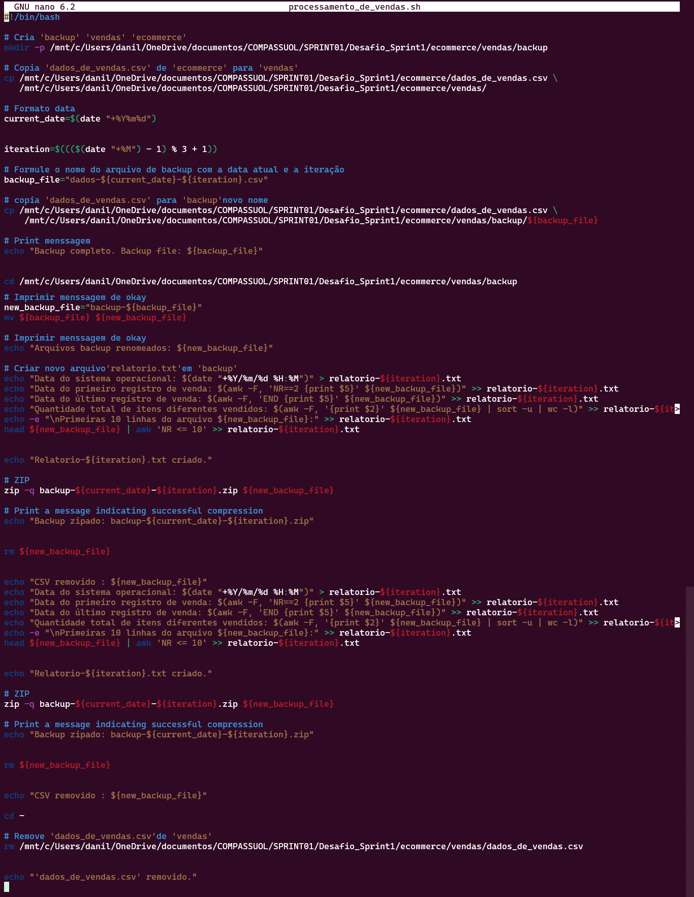
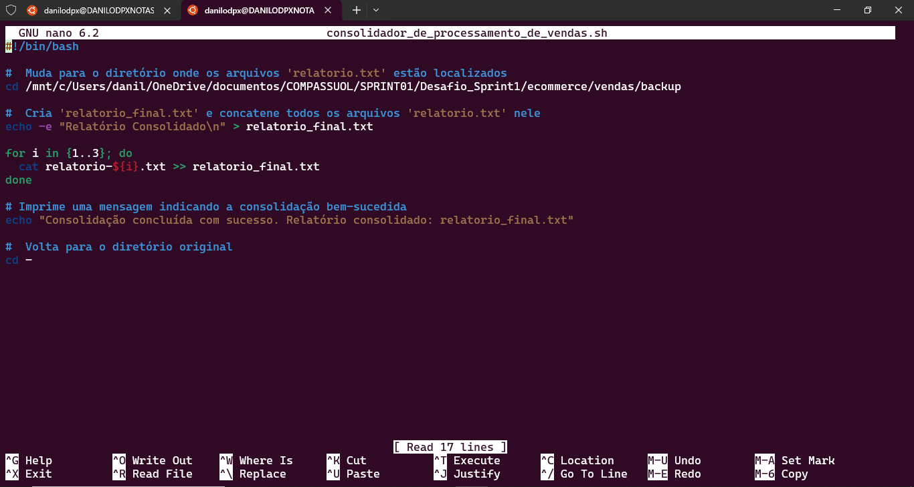
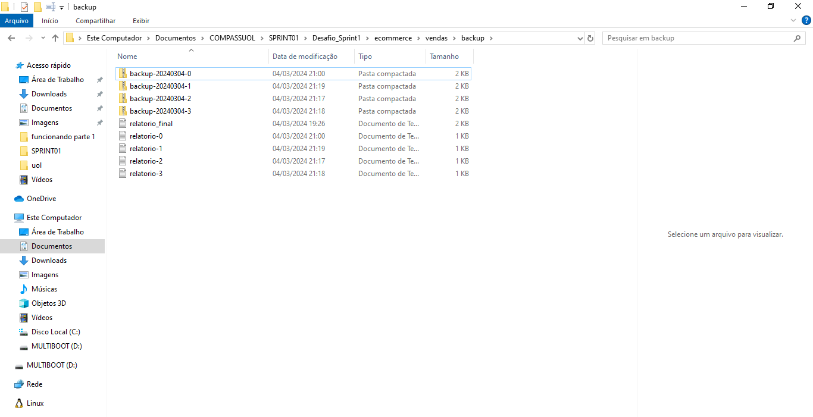

# Sprint 1
<details>
<summary>💾 Menu Sprints</summary>

- [Sprint 2](../Sprint2/README.md)
- [Sprint 3](../Sprint3/README.md)
- [Sprint 4](../Sprint4/README.md)
- [Sprint 5](../Sprint5/README.md)
- [Sprint 6](../Sprint6/README.md)
- [Sprint 7](../Sprint7/README.md)
- [Sprint 8](../Sprint8/README.md)
- [Sprint 9](../Sprint9/README.md)
- [Sprint 10](../Sprint10/README.md)
</details>

# Desafio da Sprint 01
- Primeiro contato com a linguagem markdown.
```
  O markdown é bem similar ao HTML, podendo fazer no texto marcações importantes, inserção de imagnes e links de forma simples.
```
- Criação de uma aprensentação no readme.
 ```
A criação de um perfil no readme é bem simples, podemos mesclar com comandos em html para uma persanalização mais sofisticada.
```
- Primeiro contato com linux
```
A lógica de progrmação em ambiente linux é estruturada e a utilização do terminal WLS no WINDOWS facilíta sua utilização sem
ter que utilizar vitural box e virtual machine, os quais utilização muito recurso de hardware.
```
> [!NOTE]
> Foi necessário estudar por conteúdo adicional para resolução do desafio da sprint 01.


# Exercícios


1. ...
[Resposta Ex1.](exercicios/ex1.txt)


2. ...
[Resposta Ex2.](exercicios/ex2.txt)


# Evidências


- Print dos comandos:

```
Execução processamento_de_vendas.sh
```


```
Execução nano processamento_de_vendas.sh
```


```
Execução nano consolidador_de_processamento.sh
```


```
Criação dos diretório e arquivos
```



# Certificados


- Certificado do Curso ABC


